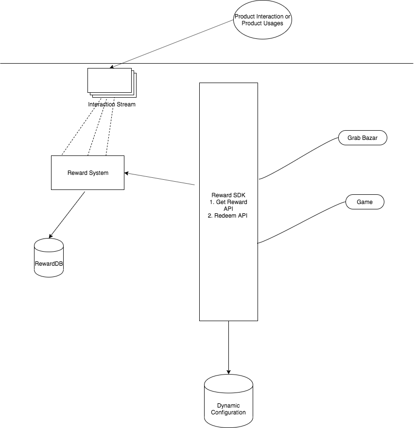

# Description

The idea is to increase user interaction and thereby wallet usage by providing a way to map each interactions of users on product in some form of Reward. Then OmniReward SDK System to integrate third party applications and services in the system using Reward points generated to give services/advantages to users.

#Architecture Diagram

##Components
####RewardSystem
####RewardSDK
####Grab Bazar

#What can be improved in me